# MUPS 三节点 LLM 协议参考

**Status:** Active  
**Version:** 1.0.0  
**Last Updated:** 2026-07-05  
**Demand:** （梳理归档，待关联 DM-20260705-003+）  
**Parent:** `openspec/specs/shared/prompttags.md`  
**Related:** `openspec/specs/d2-context-engine/d7-boundary.md` § MaterializeForMUPS

> 本文以 **代码实现** 为 SoT，描述 Observe / Plan / Execute 三节点与大模型的输入协议、输出协议、系统动态提示词结构与组装顺序。Verify / Learn / Decide 不在 Materialize 范围内。

---

## 1. 总览

| 维度 | Observe | Plan | Execute |
|------|---------|------|---------|
| **Encoding Profile（输入）** | `lineframe` | `lineframe` | ReAct 多轮对话 |
| **Encoding Profile（输出）** | `wholebody` JSON 数组 | `wholebody` JSON 对象 | `envelope` 标签 + 散文 |
| **工具** | 无 | 无 | 按 `toolProfile` 过滤 |
| **D2 入口** | `MaterializeForMUPS(phase=observe)` | `MaterializeForMUPS(phase=plan)` | `MaterializeForMUPS(phase=execute)` |
| **D7 调用方** | `LLMObservationProposer` | `LLMStrategicPlanProposer` | `DefaultWorkItemExecutor.prepareContext` |

**I/O 注册表：** `internal/shared/prompttags/registry.go` — `LineFrameRegistry`、`WholeBodyRegistry`、`MUPSRegistry`、`MUPSIOCatalog`。

**System 组装顺序**（`AssembleMUPSSystemPrompt`）：

```text
outputHints → workItemBody → phaseAppendix → staticBase
```

| Phase | outputHints | workItemBody | phaseAppendix | staticBase |
|-------|-------------|--------------|---------------|------------|
| Observe | — | — | `ObservationTaskAppendix` | D2 PrepareBase / devrix_core |
| Plan | — | — | `StrategicPlanAppendix` | 同上 |
| Execute | `BuildExecuteOutputHints` + 动态 envelope | `buildWorkItemSystemBody` | rollup 时 `RollupSynthAppendix` | 同上 |

---

## 2. Observe 节点

### 2.1 角色定位

封闭式分类器：输入 = `directive` + 结构化 `signal`；输出 = Obs* JSON 数组。不执行工具、不评估任务完成度、不分析任务本身。

**代码：** `i18n/format_hints_mups.go` — `observationTaskAppendix*Intro/Suffix`；`i18n/prompttags_semantics_zh.go` — `observe.node_role`。

### 2.2 输入协议（User Message）

**Profile：** `EncodingLineFrame`（`key: value` 行，可选 `[data]`/`[control]` 前缀）。

**Frame 名：** `observe_user`（`FrameObserveUser`）。

**字段顺序 SoT：** `ObserveUserFrame` + `ObserveSignalInput`（`pt` struct tag 注册，`MustRegisterFrame`）。

| # | 字段 | Plane | 省略 | 说明 |
|---|------|-------|------|------|
| 1 | `work_item_id` | control | — | WorkItem ID |
| 2 | `directive` | data | — | 任务指令 |
| 3 | `prior_parse_reject` | control | omit_empty | 上轮 ParseReject compact JSON |
| 4 | `prior_mean` | control | omit_zero | 贝叶斯先验 |
| 5 | `scope_goal` | data | omit_empty | ScopeContract 目标 |
| 6 | `scope_open_question` | data | omit_empty，多行 | 开放问题 |
| 7 | `signal` | data | omit_empty，多行 | artifact_summary、child_downlink 等 |
| 8 | `prior_observation_ids` | control | omit_empty，逗号连接 | 增量 Obs ID |
| 9 | `incremental_only` | control | omit_zero | 增量轮标记 |

**User 消息结构**（`buildLLMObservationUserPrompt`）：

```text
[平面指南 + 条件 glossary]     ← RenderFrameFieldGuideForFields(observe_user, loc, nil)
[空行]
[lineframe 正文]               ← BuildLineFrameFromStruct(FrameObserveUser, ObserveSignalInput)
```

**禁止输入：** WorkItem 私有 ReAct transcript（`ObserveSignalInput` 注释 LC6 / T35）。

**输入构建：** `buildObserveSignalInput` — 从 WorkItem、TaskManager、LastRound、ChildDownlink 组装。

### 2.3 输出协议（LLM Response）

**Profile：** `EncodingWholeBody` — 裸 JSON 数组（`ParseWholeBody` 可去 ` ```json ` fence）。

**Schema**（`DocBlockObserveSchema`）：

```json
{
  "kind": "obs_fact|obs_signal|obs_uncertainty|obs_deviation",
  "strength": "0.0-1.0",
  "statement": "...",
  "question": "...",
  "evidence": ["wi_id"]
}
```

**解析：** `parseObservationProposalsJSON` → `ParseWholeBody[[]rawObsProposal]` → `mapRawObsKind`。

**Go 侧 Gate（非 prompt 散文）：**

| Gate | 代码 |
|------|------|
| 最多 3 条 | `maxObservationProposals = 3`，`ValidateObservationProposals` |
| obs_fact strength ≤ 0.85 | `maxLLMObsFactStrength` |
| obs_uncertainty 必填 question | `validateOneProposal` |
| evidence 补 session/wi ID | `validateOneProposal` |
| 全失败 → parse reject | `RejectValidateEmpty` |

### 2.4 系统动态提示词

**Materialize：** `MUPSMaterializer` Observe 分支 — 无 outputHints / workItemBody；`phaseAppendix = ObservationTaskAppendix(loc)`。

**PhaseAppendix 结构：**

```text
[封闭式分类器 intro — 角色 / 输入输出 / 负面约束]
[RenderSemanticAppendix(Observe) — 节点角色 + 语义 JSON-lines + 条件 glossary]
每个元素：
[DocBlockObserveSchema]
[suffix — 只用提供的 signal、优先 obs_uncertainty、空数组合法]
```

**语义规则 SoT：** `prompttags/semantics.go` → `observeSemantics.OutputRules` → `SemanticBlock(phase)`。

**LLM 调用：** `LLMObservationProposer` — SystemPrompt（materialized）+ 单条 User（proposer 自建）；**Tools = 空**。

---

## 3. Plan 节点

### 3.1 角色定位

战略提案助手：基于 directive + Obs 摘要，输出 execution_mode、scope、child_specs、deliverable_contract。

**代码：** `i18n/prompt_dynamic.go` — `StrategicPlanAppendix`；`plan.node_role`。

### 3.2 输入协议（User Message）

**Profile：** `EncodingLineFrame`，frame = `plan_user`。

**字段顺序 SoT：** `PlanUserFrame` + `StrategicPlanFrame`（16 字段，Budget 9 字段扁平化）。

| # | 字段 | Plane | 条件 |
|---|------|-------|------|
| 1–3 | work_item_id, directive, prior_parse_reject | control/data | 同 Observe |
| 4–5 | observation_ids, observation_summary | data | Obs 上下文 |
| 6–14 | depth … max_iters | control | 仅 `Budget.MaxChildren > 0` 时整组 |
| 15–16 | parent_scope_in, uncertainty_mean | control | 子集约束 / single 模式 gate |

**User 消息结构**（`buildStrategicPlanUserPrompt`）：

```text
[仅实际出现字段的平面指南]   ← RenderFrameFieldGuideForFields(plan_user, loc, fieldMap)
[空行]
[lineframe 正文]             ← BuildLineFrameFromStruct(FramePlanUser, StrategicPlanFrame)
```

**fieldMap 来源：** `planFrameToMap(buildStrategicPlanFrame(in))` — 与 lineframe omit 规则一致。

### 3.3 输出协议（LLM Response）

**Profile：** `EncodingWholeBody` — JSON 对象。

**Schema**（`DocBlockPlanSchema(contractExample)`）：

```json
{
  "execution_mode": "single|decompose|parallel_probe",
  "scope_in": ["path/"],
  "child_specs": [
    {
      "title": "...",
      "directive_suffix": "...",
      "expected_return": "...",
      "scope_in": ["path/"]
    }
  ],
  "deliverable_contract": {
    "citation": "file_line",
    "severity": "p0_p1",
    "reject": ["planning_meta"],
    "min_runes": 0
  },
  "react_iters_hint": 5,
  "rationale": "..."
}
```

**解析：** `parseStrategicPlanJSON` → `ParseWholeBody[rawStrategicPlan]`。

**Go 侧 Gate：**

| Gate | 类型 | 代码 |
|------|------|------|
| budget 超限 | `StrategicPlanReject` → 下轮 `prior_parse_reject` | `applyBudgetCap` |
| 高 uncertainty 禁 single | `StrategicPlanReject` | `applySingleModeUncertaintyGate` |
| decompose 需 child_specs | parse error | `validateStrategicPlan` |
| child 数硬 cap | 安全网 | `CapChildSpecs` |

### 3.4 系统动态提示词

**PhaseAppendix 结构：**

```text
[Plan 角色 — 仅返回 JSON]
[RenderSemanticAppendix(Plan)]
[DocBlockPlanSchema]
deliverable_contract 维度: ContractDimensionPromptDoc()
规则: 只用 directive+Obs 摘要; react_iters_hint 1–5
```

**LLM 调用：** `LLMStrategicPlanProposer` — System + 单条 User；**Tools = 空**。

---

## 4. Execute 节点

### 4.1 角色定位

WorkItem ReAct 执行器：可调工具，终局输出 machine-readable 标签块 + 可选 `<conclusion>`。

特殊：`toolProfile=rollup_synth` — 父节点 rollup，禁止新 tool call（`RollupSynthAppendix`）。

### 4.2 输入协议（Messages）

**Profile：** 多轮 ReAct（Partition Materializer 历史链），非 lineframe。

**System — workItemBody**（`buildWorkItemSystemBody`）：

```text
WorkItemExecuteIntro (locale)
Directive: ...
ScopeIn: (bullet list)
ScopeOut: (bullet list)
ExpectedReturn: ...
[SignalLines...]
```

字段标签 **固定英文**（`WorkItemExecuteFieldLabels`）；值跟随用户 locale。

**System — outputHints**（`BuildExecuteOutputHints`）：

- `WorkItemExecuteOutputHints` — 语义 appendix + `ExecuteOutputTagDoc`
- 动态 envelope（`prompttags.Wrap`）：
  - `<deliverable_schema>`
  - `<scope_contract>` JSON
  - `<prior_verify_reason>`

**User：** `prepared.Messages`（ReAct 链）或 fallback 单条 directive。

**Ephemeral hints（不持久化）：** `<deliverable_format>`、末轮 tool 禁用提示等。

**Tools：** `RunFilterPipeline` — 按 phase / toolProfile / taskKind / agentProfile 过滤。

### 4.3 输出协议（LLM Response）

**Profile：** Envelope 标签 + 散文。

| 标签 | Profile | Phase | 语法来源 |
|------|---------|-------|----------|
| `open_questions` | linefield | Execute | `ExecuteOutputTagDoc` |
| `scope_contract` | envelope | Execute | `ScopeContractJSONShape` |
| `deliverable_schema` | envelope | Execute | 注册 schema 名 |
| `deliverable_contract` | envelope | Execute | JSON citation/severity/reject |
| `prior_verify_reason` | envelope | Execute/Verify | 文本 |
| `conclusion` | 散文 | Execute | 非 registry，DocBlock 硬编码 |

**提取：** `prompttags.ExtractAll(content, "execute")`。

**语义规则 SoT：** `executeSemantics.OutputRules` + react/final 两节（`execute.output.section.*`）。

### 4.4 系统动态提示词

**完整 System 拼接：**

```text
1. outputHints   — 输出块说明 + 语义 JSON + 标签 syntax + 动态 envelope
2. workItemBody  — Directive / Scope / ExpectedReturn
3. phaseAppendix — rollup_synth 时 RollupSynthAppendix，否则空
4. staticBase    — PrepareBase / devrix_core + 会话上下文
```

**LLM 调用：** `DefaultWorkItemExecutor` — System + Messages + Tools。

---

## 5. 跨轮反馈

**Observe / Plan：** `prior_parse_reject` lineframe 字段。

```json
{
  "phase": "observe|plan",
  "code": "parse_fail|budget_cap|uncertainty_gate|scope_gate|validate_empty",
  "field": "...",
  "message": "...",
  "requested": 4,
  "max_allowed": 2,
  "snippet": "..."
}
```

**SoT：** `prompttags/parse_reject.go` — `ParseRejectRecord.CompactJSON()`。

**Execute：** `prior_verify_reason` envelope + `WorkItemPipelineRound` / spawn feedback（非 lineframe）。

---

## 6. 数据流

```mermaid
flowchart TB
  subgraph Observe
    O_IN[ObserveSignalInput] --> O_FRAME[BuildLineFrameFromStruct]
    O_FRAME --> O_USER[User: guide + lineframe]
    O_MAT[MaterializeForMUPS observe] --> O_SYS[System: phaseAppendix + staticBase]
    O_SYS --> O_LLM[LLM 无 tools]
    O_USER --> O_LLM
    O_LLM --> O_OUT[JSON Array Obs*]
  end

  subgraph Plan
    P_IN[StrategicPlanInput] --> P_FRAME[StrategicPlanFrame]
    P_FRAME --> P_USER[User: guide + lineframe]
    P_MAT[MaterializeForMUPS plan] --> P_SYS[System: phaseAppendix + staticBase]
    P_SYS --> P_LLM[LLM 无 tools]
    P_USER --> P_LLM
    P_LLM --> P_OUT[JSON Object strategic_plan]
  end

  subgraph Execute
    E_MAT[MaterializeForMUPS execute] --> E_SYS[System: hints + body + staticBase]
    E_HIST[ReAct 历史] --> E_LLM[LLM + Tools]
    E_SYS --> E_LLM
    E_LLM --> E_OUT[Envelope tags + conclusion]
  end
```



---

## 7. 源码索引

| 关注点 | 路径 |
|--------|------|
| I/O 注册表 | `internal/shared/prompttags/registry.go` |
| Lineframe 字段 / 序列化 | `internal/shared/prompttags/linefield.go`, `structbind.go` |
| 输出 Schema | `internal/shared/prompttags/docblock.go` |
| 语义规则 | `internal/shared/prompttags/semantics.go`, `semantic_block.go`, `semantic_rule.go` |
| Parse reject | `internal/shared/prompttags/parse_reject.go` |
| System 组装 | `internal/layers/contextengine/materialize/mups_materializer.go`, `phase_prompts.go` |
| Observe 调用 | `internal/layers/orchestration/sessionorchestrator/llm_observation_proposer.go`, `observation_proposer.go` |
| Plan 调用 | `internal/layers/orchestration/sessionorchestrator/strategic_plan_proposer.go` |
| Execute 调用 | `internal/layers/orchestration/sessionorchestrator/workitem_executor.go`, `materialize/prompts.go` |
| i18n 附录 | `internal/layers/contextengine/i18n/format_hints_mups.go`, `prompt_dynamic.go`, `workitem_execute.go`, `prompttags_semantics_render.go` |

---

## 8. 优化审查（2026-07-05）

> 本节记录协议内容与组装方式的已知差距与改进候选，供后续 demand 引用。

### 8.1 已对齐的设计优点

- **单一 parse profile**：每 phase 输出一种 EncodingProfile，与 `MUPSIOCatalog` 一致。
- **Go struct SoT**：Observe/Plan user frame 由 `pt` tag + `MustRegisterFrame` 保证字段/plane/顺序一致。
- **Enforce 对齐**：`SemanticsForPhase` 中 `Enforced: true` 项与 Go gate 同名（max_proposals、budget_cap、uncertainty_gate 等）。
- **跨轮反馈结构化**：`ParseRejectRecord` / `prior_parse_reject` 与 lineframe 同 profile（compact JSON）。
- **Execute 动静分离**：outputHints（机器契约）与 workItemBody（任务内容）分块，rollup 有独立 appendix。

### 8.2 待改进项（按优先级）

| ID | 节点 | 问题 | 建议 | 严重度 |
|----|------|------|------|--------|
| OPT-01 | Observe | guide 列全字段 | **DONE** — `observeLLMFieldMap` + fieldMap guide | — |
| OPT-02 | Observe/Plan | System 过重 | 待另 demand（PrepareBase 裁剪） | P1 |
| OPT-03 | 全局 | 语义三层重叠 | **PARTIAL** — 去掉 node_role 重复；glossary 仍保留 | P2 |
| OPT-04 | Plan | execution_mode 散文 | 待 003 后续 | P2 |
| OPT-05 | Execute | 字段标签英文 | **DONE** — `WorkItemExecuteLabelsFor` | P2 |
| OPT-06 | Execute | hints 在 body 前 | **DONE** — Execute 专用组装顺序 | P2 |
| OPT-07 | Observe | intro/node_role 重复 | **DONE** | P3 |
| OPT-08 | Execute | conclusion 未注册 | 未改 | P3 |
| OPT-09 | 全局 | Materializer Messages 误导 | 未改 | P3 |

**DM-20260705-004 额外变更：**

- 去掉 lineframe `[control]`/`[data]` 行前缀（`BuildLineFrameFromStruct` → `BuildLineFrame`）
- Observe user 不发送 orchestration-only control 字段

### 8.3 不建议改动的约束

- Observe **不得**注入 ReAct transcript（LC6）— 保持 signal-only。
- Plan **不得**在 prompt 中硬编码战术切片（D7 反模式）— budget/scope 仅 control plane 数字。
- Execute envelope tag 顺序与 `ExecuteOutputTagDoc` 保持一致 — Verify 解析依赖。
- `prior_parse_reject` 位于 `directive` 之后 — 跨轮反馈可见性约定。
